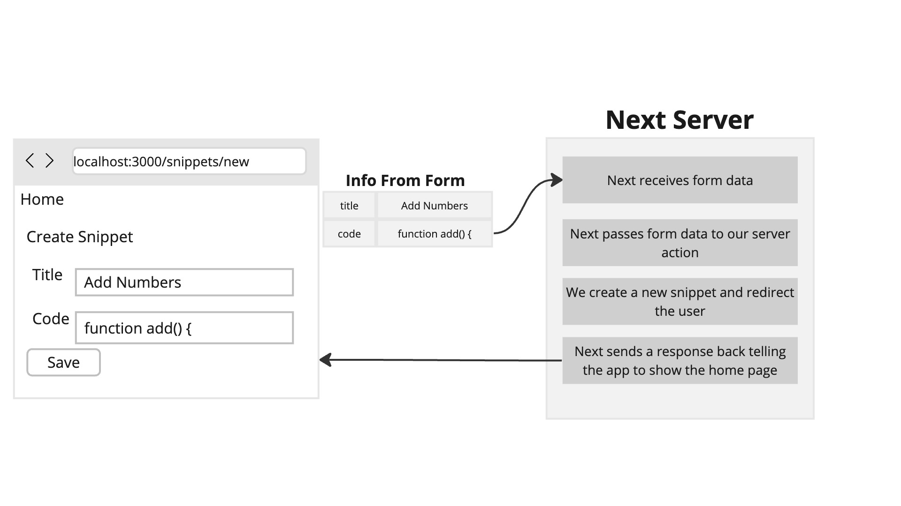
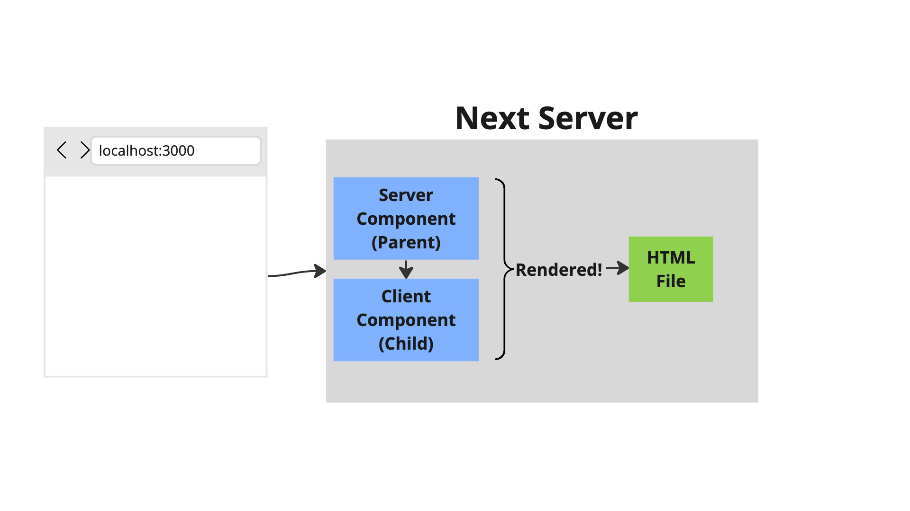
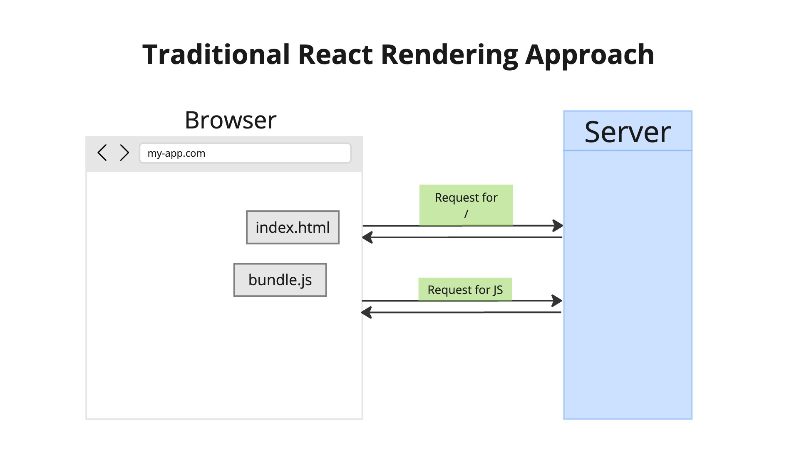
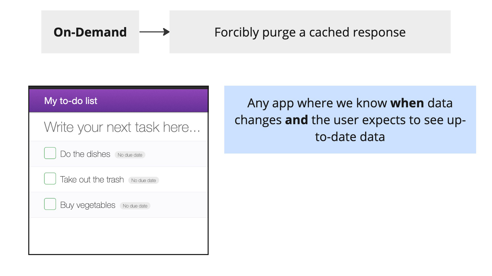
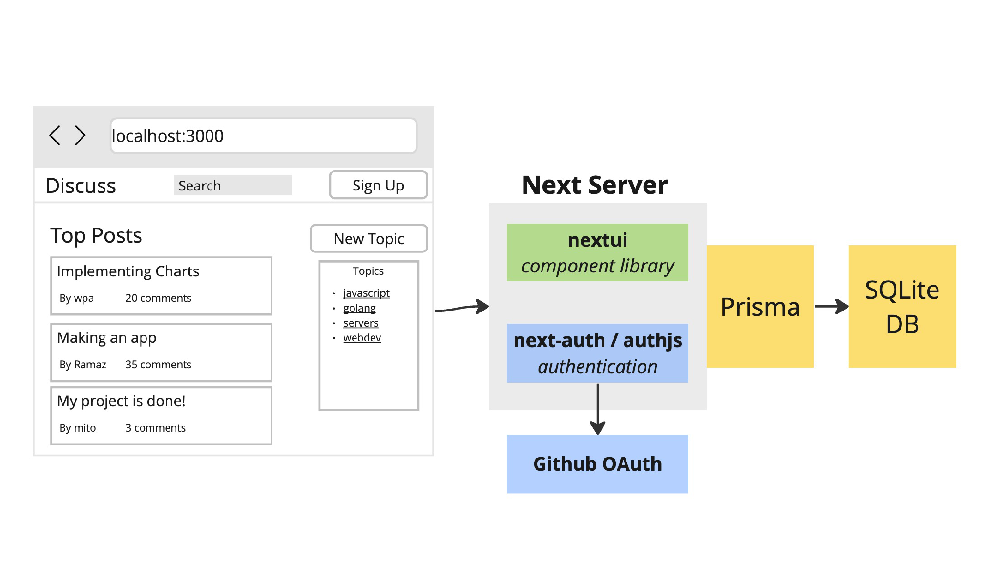
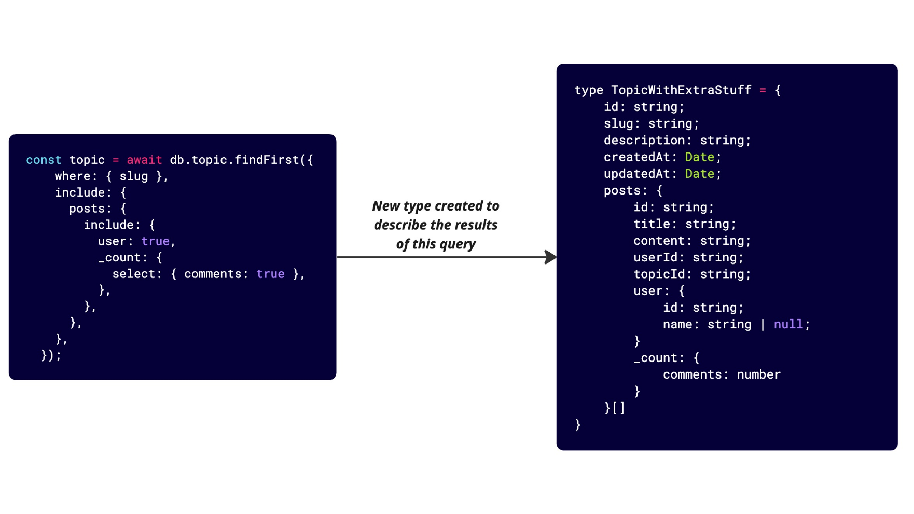
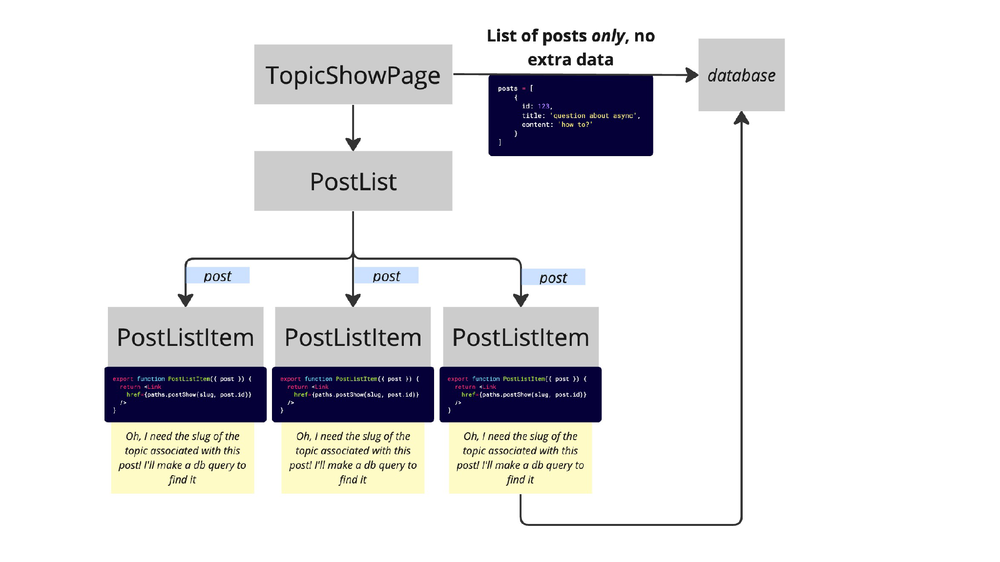

# Next JS: The Complete Developer's Guide - Stephen Grider
https://www.udemy.com/course/next-js-the-complete-developers-guide/

# Table of Contents

1. [Section 1: Get Started Here!](#section-1-get-started-here)
1. [Section 2: Changing Data with Mutations](#section-2-changing-data-with-mutations)
1. [Section 3: Streaming Content with React Server Components](#section-3-streaming-content-with-react-server-components)
1. [Section 4: Server Actions in Great Detail](#section-4-server-actions-in-great-detail)
1. [Section 5: Server Forms with the UseFormState Hook](#section-5-server-forms-with-the-useformstate-hook)
1. [Section 6: Understanding Next's Caching System](#section-6-understanding-nexts-caching-system)
1. [Section 7: Authentication with Next-Auth](#section-7-authentication-with-next-auth)
1. [Section 8: Using Data - Database Queries](#section-8-using-data---database-queries)
1. [Section 9: Caching with Request Memoization](#section-9-caching-with-request-memoization)
1. [Section 10: Implementing Search Functionality](#section-10-implementing-search-functionality)
1. [Section 11: Supplement - React Primer](#section-11-supplement---react-primer)
1. [Section 12: Supplement - TypeScript Primer](#section-12-supplement---typescript-primer)

# Section 1: Get Started Here!

---

 

# Section 2: Changing Data with Mutations

   

   

---

 

# Section 3: Streaming Content with React Server Components

   

   

   

   

   

   

   

   

   

   

   

   

   

   

   

   

   

   

   

---

 

# Section 4: Server Actions in Great Detail

   

   

   

   

   

   

   

---

 

# Section 5: Server Forms with the UseFormState Hook

   

   

   

   

---

 

# Section 6: Understanding Next's Caching System

   

---

 

# Section 7: Authentication with Next-Auth

---

 

# Section 8: Using Data - Database Queries

---

 

# Section 9: Caching with Request Memoization

---

 

# Section 10: Implementing Search Functionality

---

 

# Section 11: Supplement - React Primer

---

 

# Section 12: Supplement - TypeScript Primer

---

 

# 10

   

   

   

   

   

   

   

   

   

   

   

   

   

   

   

   

   

# 11

   

   

   

   

   

   

   

   

   

   

   

   

   

   

   

   

   

   

   

   

   

   

   

   

   

   

   

# 12

   

   

   

   

   

   

   

   

   

   

   

   

   

   

   

   

   

   

   

   

   

   

   

   

# 13

   

   

   

   

   

   

   

   

   

   

   

   

   

   

# 14

   

   

# 15

   

   

   

   

   

   

   

   

   

   

   

   

# 16

   

   

   

   

   

   

   

   

   

   

   

   

   

   

   

   

   

   

# 17

   

   

   

   

   

   

   

   

   

   

   

   

   

   

   

   

   

   

   

   

   

   

   

   

   

   

   

   

   

# 18

   

   

   

   

   

   

   

   

   

   

# 19

   

   

   

   

   

   

   

   

   

   

   

   

   

   

   

   

   

   

   

   

   

   

   

   

   

# 20

   

   

   

   

   

   

   

   

   

   

   

   

   

   

   

   

   

   

   

   

   

   

   

   

   

   